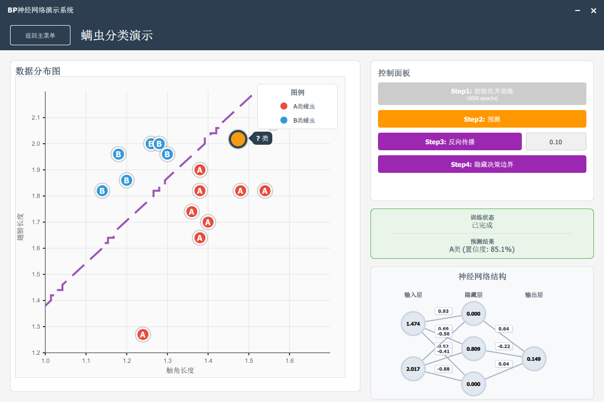

# BP 神经网络课程设计

本项目为合肥工业大学计算机与信息学院(人工智能学院)24级学生的《数据结构》课程设计作品。

## 项目功能

本项目实现了一个BP神经网络，并将其应用于以下两个方面：

1.  **手写数字识别**: 使用MNIST数据集训练神经网络，实现手写数字的识别功能。
2.  **螨虫分类**: 根据螨虫的特征数据，训练神经网络进行分类。

演示效果如下：

详细的实现原理、过程和结果请参见项目中的PDF报告文件：[课程设计报告-BP神经网络.pdf](课程设计报告-BP神经网络.pdf)。

## 技术栈
本项目使用以下技术栈：
- **C++**: 核心算法实现语言
- **Qt/QML**: 图形用户界面框架
- **MNIST数据集**: 手写数字识别训练数据

## 文件结构

主要代码文件说明：

*   `bpnn.h` / `bpnn.cpp`: BP神经网络核心算法的实现。
*   `mnist_reader.h` / `mnist_reader.cpp`: MNIST数据集读取模块。
*   `mnist_classifier.h` / `mnist_classifier.cpp`: 手写数字识别分类器实现。
*   `mitenetworkmodel.h` / `mitenetworkmodel.cpp`: 螨虫分类网络模型。
*   `main.cpp`: 主程序入口。
*   `*.qml`: QML文件，用于构建图形用户界面。
*   `mnist_model.bin`: 预训练的手写数字识别模型文件。

可执行文件见该项目的Releases页面。
